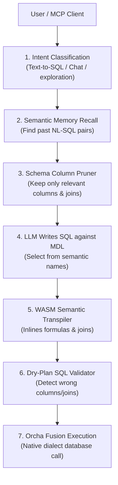

<div align="center">
  <picture>
    <source media="(prefers-color-scheme: dark)" srcset="public/graphics/orca%20ai%202.png">
    
  </picture>

  <h1>Orcha Agent OS 🌌</h1>
  <h3>The Semantic Operating System for Multi-Tenant AI Agents</h3>
  <p><i>Bridges the gap between raw data warehouses and context-aware AI agents.</i></p>

  <p>
    
    
    
    
    
    
  </p>

  <p>
    <a href="#-features">Features</a> ·
    <a href="#-architecture">Architecture</a> ·
    <a href="#-getting-started">Getting Started</a> ·
    <a href="#-repository-structure">Repository Structure</a>
  </p>
</div>

---

## 🚀 Vision

In the age of Large Language Models (LLMs), the primary barrier to reliable data intelligence isn't SQL syntax generation—it's **business semantics**. AI agents lack the context to understand what raw tables mean.

Orcha Agent OS provides a **Semantic Context Layer** that translates raw database schemas into a unified, versionable, and secure Model Definition Language (MDL) manifest. AI agents query through this semantic model, ensuring queries are always accurate, pre-validated, and governed.

---

## ✨ Features

* **🧠 Semantic Bridge & ModelerWizard**: Map raw table structures to friendly business terms, declare calculated variables (e.g. `margin = revenue - cost`), and set primary/foreign keys via a React Flow schema editor.
* **🦀 Rust-Powered WASM Engine**: On-the-fly SQL transpilation using an embedded WebAssembly build of Apache DataFusion. Resolves calculated virtual columns and schema differences in sub-seconds.
* **🔌 Automatic Join Pathing**: Traverses table relationships via a Breath-First Search (BFS) graph pathing algorithm to automatically inject ANSI SQL `JOIN` clauses before executing queries.
* **🌐 Federated Multi-Database Execution**: Query, join, and aggregate data across separate database configurations using a simple `alias.table` naming convention.
* **🔑 Developer Portal**: Securely expose your database semantic layer as an API. Issue API keys mapped to multiple databases with a Mantine MultiSelect builder.
* **📓 Databook & Exploration**: Browse saved query records, filter columns, view execution steps, and explore full agent query transcripts.
* **🛡️ Secure Dialects**: Native unparsing and dialect translation support for **PostgreSQL, MySQL, SQLite, and MSSQL**.

---

## ⚡ Architecture: Query Flow

Every natural language question undergoes a governed validation and compilation pipeline before touching your data:



---

## 📂 Repository Structure

```
├── app/                          # Next.js Pages & Routes (SaaS layouts, Databook, Developers Portal)
├── components/                   # React UI Components (React Flow Modeler, BI Genie panels, Datatables)
├── convex/                       # Serverless Backend Database (Schemas, Vector indexes, Semantic Memory)
├── lib/                          # Core Orchestration Libraries
│   ├── engine/                   # OrchaFusion multi-database executor
│   ├── wasm-engine/              # Compiled Rust Apache DataFusion WebAssembly binary
│   ├── chat-agent.ts             # Intent classifier and semantic agent
│   ├── column-pruner.ts          # LLM-based column context optimizer
│   ├── query-rewriter.ts         # Query conversational context rewriter
│   ├── semantic-transpiler.ts    # SQL unparsing and joins injector
│   └── sql-validator.ts          # Static SQL dry-plan schema checking rules
│
├── orcha-embedding-transformer/  # Local Python FastAPI microservice for zero-cost RAG embeddings
├── orcha-rust-engine/            # Source code for the Rust compilation library
├── tests/                        # Integration, contract, and unit tests
└── Zenta/                        # Local clone of WrenAI semantic context library
```

---

## 🏁 Getting Started

### Prerequisites
* **Node.js 20+**
* **pnpm / npm**
* A **Convex** account (for reactive storage & vector search)
* A **Clerk** account (for SaaS client authentication)

### 1. Clone & Install Dependencies
Clone the repository and install npm packages:

```bash
git clone https://github.com/your-repo/orcha-agent-os.git
cd orcha-agent-os
npm install
```

### 2. Configure Environment Variables
Copy the example environment configurations:

```bash
cp .env.example .env.local
```
Add your Clerk and Convex access tokens to `.env.local`.

### 3. Spin Up Convex Backend
In a separate terminal, start the Convex development environment:

```bash
npm run convex:dev
```

### 4. Run Next.js Application
Start the Next.js SaaS server:

```bash
npm run dev
```
Open `http://localhost:3000` to explore the Semantic Modeler, Genie Command Center, and Databook.

---

## 🤖 Local Embedding Transformer

For databases with large schemas, Orcha uses a self-hosted Sentence Transformer FastAPI microservice to generate vectors locally:

```bash
# Start the transformer container on port 5001
docker-compose up --build -d orcha-embeddings
```
Check out the [orcha-embedding-transformer/README.md](file:///c:/repos/orcha-agent-os/orcha-embedding-transformer/README.md) for local configuration and specifications.

---

## 🧪 Verification & Development Commands

Ensure code stability by running tests and compilation audits:

```bash
# Run TypeScript compilation checks
npx tsc --noEmit

# Run unit and contract tests
npm run test
```

---

## ⚖️ License

Distributed under the Apache License 2.0. See `LICENSE` for details.
