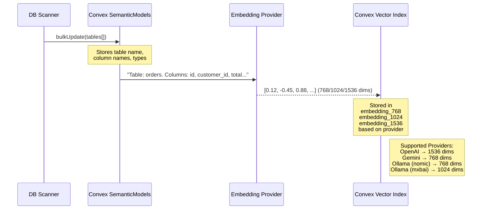
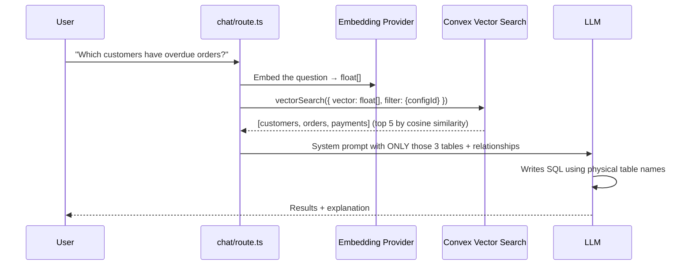

# The Orcha Semantic Bridge

This document explains how Orcha transforms a raw database into an "AI-intelligent" business model, and how the **Vector Memory Engine** enables semantic search at massive scale.

---

## 1. The Full Architecture: Two-Layer Intelligence

Orcha operates two parallel intelligence layers that work together to answer questions accurately on any database, at any scale.

```mermaid
graph TD
    subgraph "Your Database (MySQL / MSSQL / Postgres)"
        DB[(Physical Database<br/>Tables & Columns)]
    end

    subgraph "Stage 1 — Schema Introspection (One-Time Setup)"
        DB --> SCAN[Database Scanner<br/>introspection.ts]
        SCAN -->|Tables, Columns, FKs| BULK[Semantic Models<br/>Convex DB]
        BULK -->|Text: 'Table: orders. Columns: id, total...'| EMBED[Embedding Engine<br/>embeddings.ts]
        EMBED -->|OpenAI / Gemini / Ollama| VEC[(Convex Vector Store<br/>embedding_768 / 1024 / 1536)]
    end

    subgraph "Stage 2 — Chat & RAG (Per Request)"
        USER([User Question]) --> EMBED2[Embed Question<br/>Same Provider]
        EMBED2 -->|float[]| VSEARCH[Vector Search<br/>semanticModels.searchRelatedModels]
        VEC --> VSEARCH
        VSEARCH -->|Top N Relevant Tables| PROMPT[System Prompt Builder<br/>chat/route.ts]
        BULK --> PROMPT
        PROMPT -->|Schema + Relationships| LLM[LLM Agent<br/>GPT / Gemini / Claude]
        LLM -->|execute_sql tool| DB
        DB --> LLM
        LLM --> USER
    end
```

---

## 2. The 6-Stage Lifecycle

| Stage | What Happens | Where |
|:---|:---|:---|
| **1. Introspect** | Scanner reads all tables, columns, types, and FK constraints from the real database | `lib/db/introspection.ts` |
| **2. Model** | Each table becomes a `SemanticModel` in Convex — physical names mapped to business names, columns typed as Dimension / Measure | `convex/semanticModels.ts` |
| **3. Enrich** | Users optionally label tables with business descriptions for better search accuracy | `/configure/[configId]` UI |
| **4. Vectorize** | Each table's description is converted to a float[] embedding and stored in Convex's vector index | `convex/embeddings.ts` |
| **5. Relate** | FK constraints are turned into a Relational Graph (pre-defined JOIN paths) | `convex/semanticRelationships.ts` |
| **6. Reason** | At chat time: the user's question is embedded, the most relevant tables are retrieved via vector search, and injected into the LLM context | `app/api/chat/route.ts` |

---

## 3. The Vector Memory Engine (Stage 4 in Detail)

This is the key to scaling to **1,000+ tables** without overwhelming the LLM context window.



### Supported Embedding Providers

| Provider | Model | Dimensions | Index Used |
|:---|:---|:---|:---|
| OpenAI | `text-embedding-3-small` | 1536 | `by_embedding_1536` |
| Gemini | `text-embedding-004` | 768 | `by_embedding_768` |
| Ollama (local) | `nomic-embed-text` | 768 | `by_embedding_768` |
| Ollama (local) | `mxbai-embed-large` | 1024 | `by_embedding_1024` |

---

## 4. RAG at Chat Time (Stage 6 in Detail)

When the user asks a question:



> **Why this matters**: If you have 500 tables, the LLM only sees the 5–10 most relevant ones. The context window stays small, latency drops, and SQL accuracy dramatically improves.

---

## 5. The Layman's Explanation (The Smart Library)

Imagine you have a **massive library** with 1,000 books, all with cryptic titles like `V1_DATA_X_2019`.

### Old Way (No Semantic Bridge):
The robot opens every book and guesses which one has "Sales." It gets it wrong 40% of the time.

### Orcha Way:

1. **The Librarian** reads every book and writes a **plain-English index card** for each one: `"V1_DATA_X_2019 → Sales Transactions: contains customer IDs, product SKUs, revenue totals."`
2. **The Memory Engine** converts each index card into a **fingerprint** (a vector) and stores it in a searchable vault.
3. **When you ask a question**, Orcha converts your question into its own fingerprint, finds the index cards with the most similar fingerprints (nearest neighbour search), and only shows the robot those books.
4. **The robot never has to guess.** It reads the 5 right books and gives you a perfect answer.

**In short: The Vector Memory Engine gives the AI a photographic memory of your entire database schema — so it always knows exactly where to look.**

---

## 6. Database Engine Compatibility

The entire pipeline works identically regardless of your database. The Semantic Bridge is **engine-agnostic**.

| Database | Introspection | Vectorization | Chat / RAG |
|:---|:---|:---|:---|
| MySQL | ✅ | ✅ | ✅ |
| PostgreSQL | ✅ | ✅ | ✅ |
| MSSQL (SQL Server) | ✅ | ✅ | ✅ |
| BigQuery | 🔜 Planned | 🔜 Planned | 🔜 Planned |
| MongoDB | 🔜 Planned | 🔜 Planned | 🔜 Planned |
