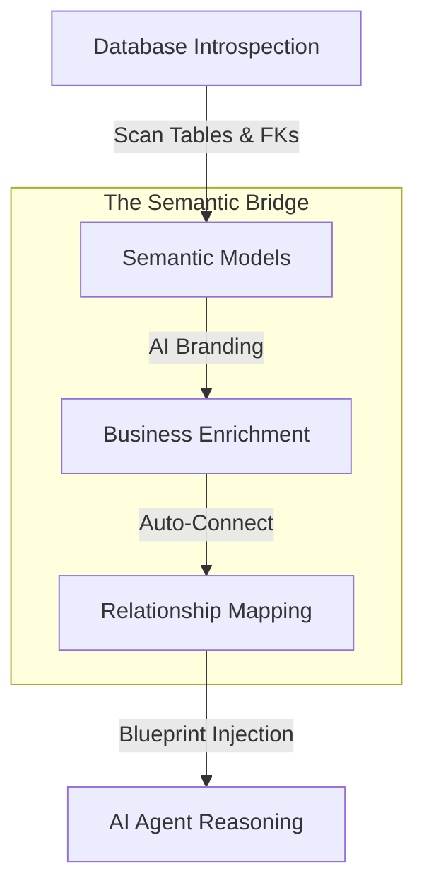

# The Orcha Semantic Bridge

This document explains how Orcha transforms a raw database into an "AI-intelligent" business model, using a strategy inspired by **Wren AI**.

## 1. How it Works (Technical Overview)

The semantic bridge acts as an **abstraction plane** between your physical database and the Large Language Model (LLM). Instead of the AI guessing your database structure, Orcha builds a **Metadata Blueprint**.

### The 4-Stage Lifecycle:

1.  **Introspection**: Orcha scans your database but specifically looks for **Foreign Key Constraints** in the `INFORMATION_SCHEMA`. This is the "Source of Truth" for how data connects.
2.  **Semantic Modeling**: Every physical table (e.g., `cust_ord_01`) is mapped to a **Semantic Entity** (e.g., `Customer Orders`). Every column is assigned a **Type** (Dimension or Measure) and an **Aggregation** (Sum, Avg).
3.  **Relationship Mapping**: Using the discovered FKs, Orcha builds a **Relational Graph**. This graph acts as a "Pre-defined JOIN Path."
4.  **Prompt Engineering**: When you ask a question, Orcha injects this entire Blueprint into the AI's "context window." The AI then uses the **Semantic Labels** and **JOIN Paths** to write 100% accurate SQL.

---

## 2. The Layman's Explanation (The Library Analogy)

Imagine you have a **massive, unorganized library** with thousands of books. 

### The Problem:
*   The books have weird titles like `V1_DATA_X`. 
*   They are written in a strictly technical language (SQL).
*   If you ask a robot, *"Find me the best-selling author,"* the robot has to open every single book and guess which one contains "Sales" and which one contains "Authors." It often gets it wrong.

### The Semantic Solution:
The **Semantic Bridge** is like hiring a **Librarian** who creates a perfect **Map and Translation Guide**:

1.  **The Map**: The librarian labels the weird `V1_DATA_X` book as **"Sales Transactions"** and link it with a string to the book labeled **"Authors."**
2.  **The Guide**: The librarian tells the robot, *"Whenever someone asks for 'Best Selling', look in the Sales book, find the 'Price' column, and add it all up."*
3.  **The Result**: Now, when you ask the question, the robot doesn't guess. It looks at the **Map**, walks directly to the right books, and uses the **Librarian's Guide** to give you the exact answer instantly.

**In short: The Semantic Bridge gives the AI the "Business Common Sense" it needs to understand your raw data.**
