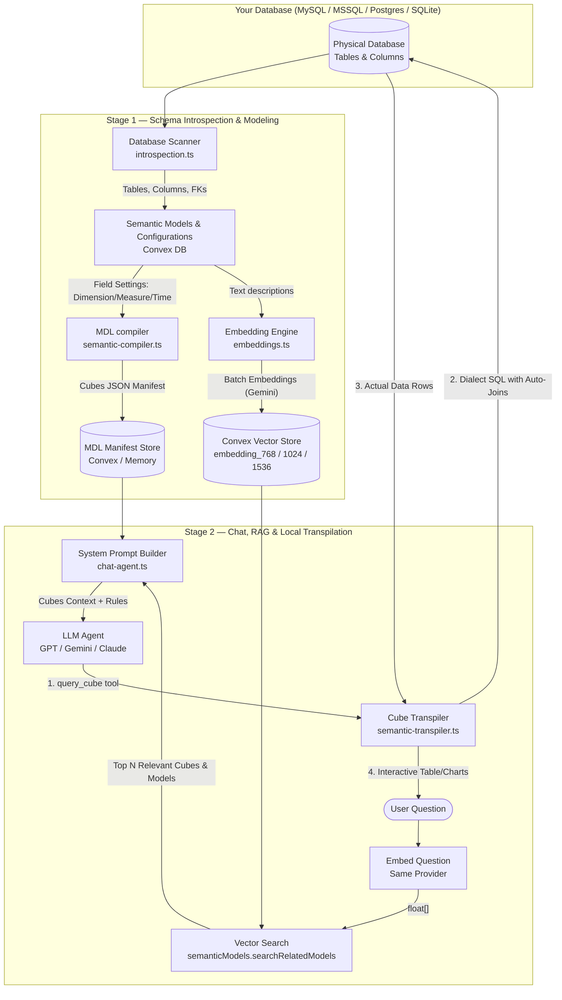
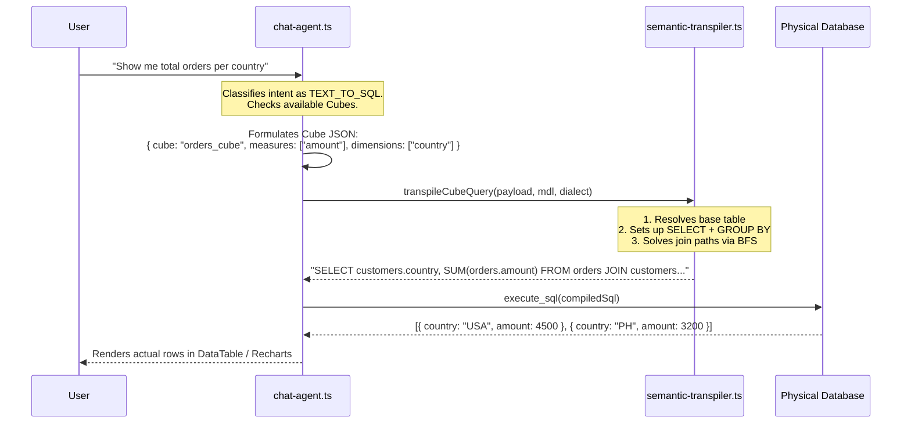

# The Orcha Semantic Bridge & Cubes Architecture

This document explains how Orcha transforms a raw database into an "AI-intelligent" business model using **Semantic Cubes**, and how the **Vector Memory Engine** and **Local Transpiler** enable near-zero (99%) hallucination query execution.

---

## 1. The Full Architecture: Three-Layer Intelligence

Orcha operates three parallel intelligence layers that work together to answer database queries accurately, at any scale, without SQL syntax failures.


```mermaid
graph TD
    subgraph DB_GROUP["Your Database (MySQL / MSSQL / Postgres / SQLite)"]
        DB[("Physical Database<br/>Tables & Columns")]
    end
 
    subgraph STAGE1["Stage 1 — Schema Introspection & Modeling"]
        DB --> SCAN["Database Scanner<br/>introspection.ts"]
        SCAN -->|"Tables, Columns, FKs"| BULK["Semantic Models & Configurations<br/>Convex DB"]
        BULK -->|"Field Settings: Dimension/Measure/Time"| COMPILER["MDL compiler<br/>semantic-compiler.ts"]
        COMPILER -->|"Cubes JSON Manifest"| MANIFEST[("MDL Manifest Store<br/>Convex / Memory")]
        BULK -->|"Text descriptions"| EMBED["Embedding Engine<br/>embeddings.ts"]
        EMBED -->|"Batch Embeddings (Gemini)"| VEC[("Convex Vector Store<br/>embedding_768 / 1024 / 1536")]
    end
 
    subgraph STAGE2["Stage 2 — Chat, RAG & Local Transpilation"]
        USER(["User Question"]) --> EMBED2["Embed Question<br/>Same Provider"]
        EMBED2 -->|"float[]"| VSEARCH["Vector Search<br/>semanticModels.searchRelatedModels"]
        VEC --> VSEARCH
        VSEARCH -->|"Top N Relevant Cubes & Models"| PROMPT["System Prompt Builder<br/>chat-agent.ts"]
        MANIFEST --> PROMPT
        PROMPT -->|"Cubes Context + Rules"| LLM["LLM Agent<br/>GPT / Gemini / Claude"]
        LLM -->|"1. query_cube tool"| TRANSPILER["Cube Transpiler<br/>semantic-transpiler.ts"]
        TRANSPILER -->|"2. Dialect SQL with Auto-Joins"| DB
        DB -->|"3. Actual Data Rows"| TRANSPILER
        TRANSPILER -->|"4. Interactive Table/Charts"| USER
    end
```

---

## 2. The 6-Stage Lifecycle

| Stage | What Happens | Where |
| :--- | :--- | :--- |
| **1. Introspect** | Scanner reads all tables, columns, types, and constraints from the database. | `lib/db/introspection.ts` |
| **2. Model** | Tables become `SemanticModel` entries in Convex. Users define column business categories (Dimensions vs. Measures). | `convex/semanticModels.ts` |
| **3. Compile** | The MDL compiler translates these models and settings into semantic **Cubes** (pre-aggregation structures). | `lib/semantic-compiler.ts` |
| **4. Vectorize** | Table and column definitions are vectorized in chunks of 25 to Google Gemini and stored in the vector store. | `convex/embeddings.ts` |
| **5. Relate** | Foreign keys are turned into a relational graph used by the BFS engine to solve joins. | `convex/semanticRelationships.ts` |
| **6. Query (WASM)** | Chat time: The agent routes requests through the `query_cube` tool, which unparses the selection to SQL and executes it. | `lib/chat-agent.ts` |

---

## 3. The Anatomy of a Cube: Elements & Meanings

A **Cube** is a logical namespace grouping your data for analysis. By defining a Cube, you tell the AI exactly how to slice and aggregate metrics, removing the need for the LLM to write raw SQL code.

```json
{
  "name": "orders_cube",
  "baseObject": "orders",
  "measures": [
    {
      "name": "amount",
      "type": "DOUBLE",
      "expression": "sum(orders.amount)"
    }
  ],
  "dimensions": [
    {
      "name": "customer_id",
      "type": "INTEGER"
    }
  ],
  "timeDimensions": [
    {
      "name": "order_date",
      "type": "TIMESTAMP"
    }
  ]
}
```

### 📊 1. Measures (What you want to aggregate)
* **Meaning**: Quantitative metrics, numbers, or KPIs that are aggregated across multiple rows.
* **Aggregations Supported**:
  - `sum`: Total summation (e.g. Total Revenue).
  - `avg`: Mathematical average (e.g. Average Order Value).
  - `count`: Unique or non-null record count (e.g. Active Customer Count).
  - `min` / `max`: Boundary values (e.g. Peak Transaction, Lowest Sales).
* **Role in SQL**: Measures are unparsed into SQL aggregations in the `SELECT` list (e.g. `SUM("orders".amount) AS "amount"`).
* **Example**: If a user asks for *"total sales"*, the AI selects the `amount` measure. The transpiler generates: `sum("orders".amount) AS "amount"`.

### 🏷️ 2. Dimensions (How you want to slice)
* **Meaning**: Qualitative attributes, categories, or groups used to filter and group your measures.
* **Typical Fields**: Names, categories, countries, status tags, IDs, email addresses.
* **Role in SQL**: Dimensions are placed in the `SELECT` list and appended to the `GROUP BY` clause (e.g. `GROUP BY "orders".customer_id`).
* **Example**: If a user wants to break down metrics by *"country"*, the AI selects the `country` dimension. The transpiler generates: `"customers".country AS "country"` and appends `GROUP BY "customers".country` to the query.

### 📅 3. Time Dimensions (Temporal Granularity)
* **Meaning**: Timestamp or date fields used to look at trends over time.
* **Time Grains**:
  - `day`: Slices data per calendar day.
  - `month`: Slices data per calendar month (e.g. Monthly Active Users).
  - `year`: Slices data per calendar year.
* **Role in SQL**: Formats dates based on the database dialect (e.g. `DATE_TRUNC('month', "orders".order_date)` on Postgres vs. `DATE_FORMAT` on MySQL) and groups by the formatted date.
* **Example**: If a user asks for trends *"by month"*, the AI selects the `order_date` time dimension with granularity `month`. The transpiler generates: `DATE_TRUNC('month', "orders".order_date) AS "order_date_month"` and appends it to the `GROUP BY` clause.

### 💡 The Layman's Explanation (The Candy Jar Analogy)
Imagine you own a **candy shop** with a massive jar containing millions of individual candies.
* **Without Cubes (Raw SQL)**: If a customer asks, *"How many red strawberry candies did we sell in December?"*, the shop clerk must dump the entire jar on the floor, read the label of every single candy, count them one-by-one, filter by color, and group by purchase date. This is slow, messy, and prone to counting mistakes.
* **With Cubes**: You pre-organize the shop into structured boxes:
  - **Measures (The Tally Counters)**: A clicker device attached to the box that automatically sums up quantities (`sum`) or computes average weights (`avg`).
  - **Dimensions (The Labels)**: Categorical sorting labels stuck on the box (e.g., Color = `Red`, Flavor = `Strawberry`).
  - **Time Dimensions (The Calendars)**: Date slots on the box sorting candies by day, month, or year.
  Now, when the customer asks the question, the clerk does not count anything. They just walk to the `Red/Strawberry` box, look at the monthly calendar slot for `December`, and read the tally counter number. **It is instant, always accurate, and requires zero counting calculations from the clerk.**

---

## 🖥️ 4. UI Configuration Guide

To configure Cubes, you use the **Semantic Bridge UI** (there is no need for a separate Cube UI). The compiler automatically compiles your configurations:

```
[UI Column Grid] ──> [Field Type dropdown] ──> [Dimension] -> (Saves as Dimension)
                                           └─> [Measure]   -> (Exposes Default Aggregation Select)
```

1. **Mapping a Dimension**:
   - Locate the target column in the **Field Definitions** list.
   - Set the **Semantic Type** dropdown to `Dimension`.
   - The field is added as a groupable dimension inside the Cube.
2. **Mapping a Measure**:
   - Set the **Semantic Type** dropdown to `Measure`.
   - Select a **Default Aggregation** (e.g. `Sum` or `Average`).
   - The compiler will automatically construct the mathematical expression (e.g., `sum(model.column)`) for the Cube.
3. **Mapping a Time Series**:
   - Click the **Time Series** ActionIcon (represented by the pulse line) on any date/timestamp column.
   - This marks the column as a `Time Dimension`, allowing the AI to query it using temporal grains (`day`, `month`, `year`).

### 🧐 How to Know You Configured Your Cubes Properly:
Use this checklist in the UI to ensure the AI has a perfect semantic model:
* **All KPI columns are Measures**: Any column representing numbers to add up, count, or average (e.g. `price`, `quantity`, `discount`, `cost`) **MUST** be set as a **Measure** with a default aggregation like `Sum` or `Average`.
* **All description/filter columns are Dimensions**: Categorical attributes used for grouping, filtering, or slicing (e.g. `status`, `country`, `category`, `product_id`, `name`) **MUST** be set as a **Dimension**.
* **Primary date columns are Time Series**: For every table containing transaction or log data, **exactly one** primary date/timestamp column (e.g., `created_at` or `order_date`) **MUST** have the **Time Series** pulse icon enabled (active cyan color). If a table has no date column, keep the time-series icon disabled.
* **No text/ID columns are Measures**: Never set string columns (like names or emails) or IDs as measures, unless you explicitly want to count unique values (using `Count`).

---

## 🔍 5. Declarative Execution Sequence (query_cube in Detail)

When a user asks: *"Show me order amounts per country"*


```mermaid
sequenceDiagram
    participant User
    participant Chat as chat-agent.ts
    participant Transpiler as semantic-transpiler.ts
    participant DB as Physical Database
    
    User->>Chat: "Show me total orders per country"
    Note over Chat: Classifies intent as TEXT_TO_SQL.<br/>Checks available Cubes.
    
    Chat->>Chat: Formulates Cube JSON:<br/>{ cube: "orders_cube", measures: ["amount"], dimensions: ["country"] }
    
    Chat->>Transpiler: transpileCubeQuery(payload, mdl, dialect)
    Note over Transpiler: 1. Resolves base table<br/>2. Sets up SELECT + GROUP BY<br/>3. Solves join paths via BFS
    
    Transpiler-->>Chat: "SELECT customers.country, SUM(orders.amount) FROM orders JOIN customers..."
    
    Chat->>DB: execute_sql(compiledSql)
    DB-->>Chat: [{ country: "USA", amount: 4500 }, { country: "PH", amount: 3200 }]
    
    Chat-->>User: Renders actual rows in DataTable / Recharts
```
