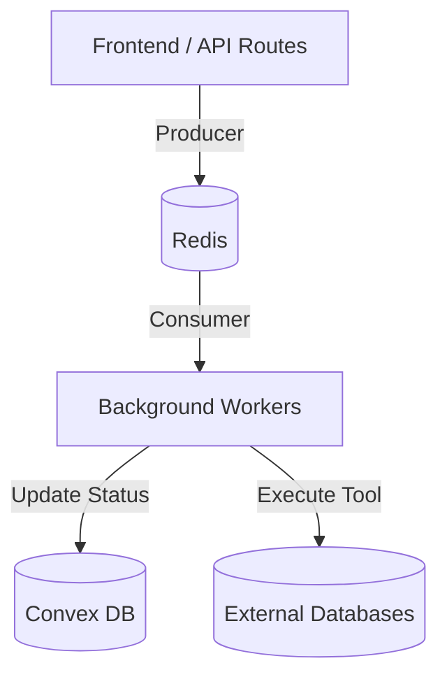

# BullMQ Implementation Documentation

Orcha Agent OS uses **BullMQ** for robust background processing, ensuring scalability and preventing API timeouts for long-running AI and data-heavy operations.

## Architecture Overview

The system follows a typical Producer/Consumer pattern using Redis as the state store.

## Key Queues

### 1. `chat-queue`
*   **Purpose**: Orchestrates AI Agent execution.
*   **Implementation**: [chat-worker.ts](file:///c:/repos/orcha-agent-os/lib/bridge/chat-worker.ts)
*   **Logic**:
    *   Initializes a fresh `ConvexHttpClient` for each job.
    *   Normalizes message history for the Vercel AI SDK.
    *   Streams results back to the database in real-time via `convex.mutation(api.chatMessages.workerUpdate, ...)`.
    *   Handles multi-turn tool execution within a single job.

### 2. `data-exports`
*   **Purpose**: Handles high-volume CSV exports (10M+ rows).
*   **Implementation**: [worker.ts](file:///c:/repos/orcha-agent-os/lib/bridge/worker.ts)
*   **Logic**:
    *   Streams data directly from external databases to local storage (or /tmp).
    *   Uses `fast-csv` for efficient memory usage.
    *   Simulates large-scale streaming that bypasses typical serverless timeouts.

## Worker Lifecycle

The workers are initialized as standalone Node.js processes using the [worker-runner.ts](file:///c:/repos/orcha-agent-os/lib/bridge/worker-runner.ts) script.

1.  **Environment Loading**: Since background workers often run outside the Next.js context, a manual `.env` loader ensures `NEXT_PUBLIC_CONVEX_URL` and `ENCRYPTION_KEY` are available.
2.  **Concurrency**: The `ChatWorker` is configured with a concurrency of **50** by default, allowing it to handle multiple agent turns simultaneously.
3.  **Graceful Shutdown**: Workers listen for `SIGINT` signals to close Redis connections and finish active jobs before exiting.

## Scaling & Error Handling

*   **Retries**: BullMQ handles automatic retries for failed jobs.
*   **Cleanup**: 
    *   Completed jobs are kept for 24 hours (max 100).
    *   Failed jobs are kept in a separate list (max 500) for debugging and manual reprocessing.
*   **Isolation**: Every job creates its own database client instance with appropriate auth tokens to ensure strict multi-tenant data isolation.

## Deployment Strategy

In production, these workers are intended to run as separate Docker containers or background services, ensuring that heavy AI computations do not compete for resources with the web server.

> [!NOTE]
> Ensure `REDIS_URL` is correctly configured in your `.env` or container environment for the workers to connect to the queue.
